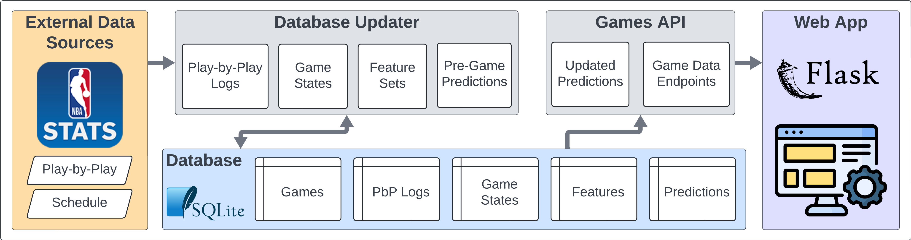
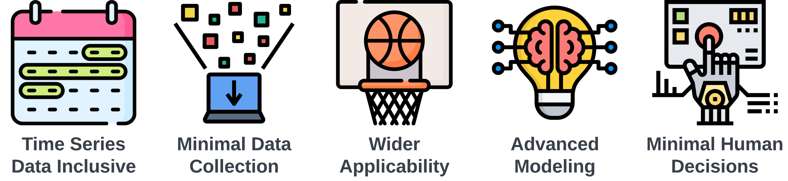
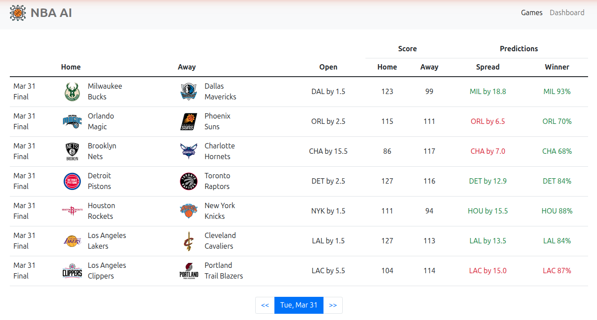
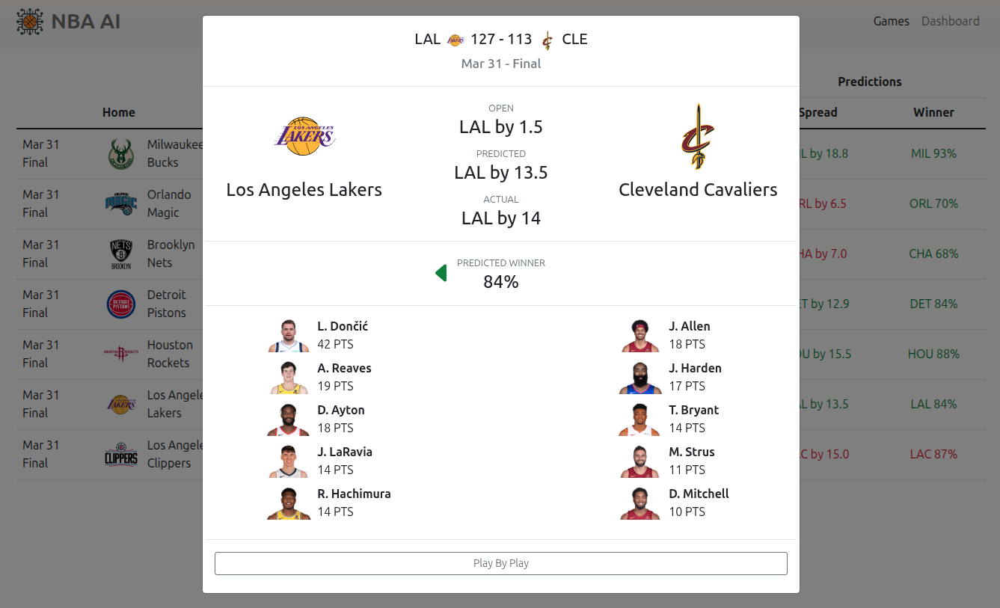
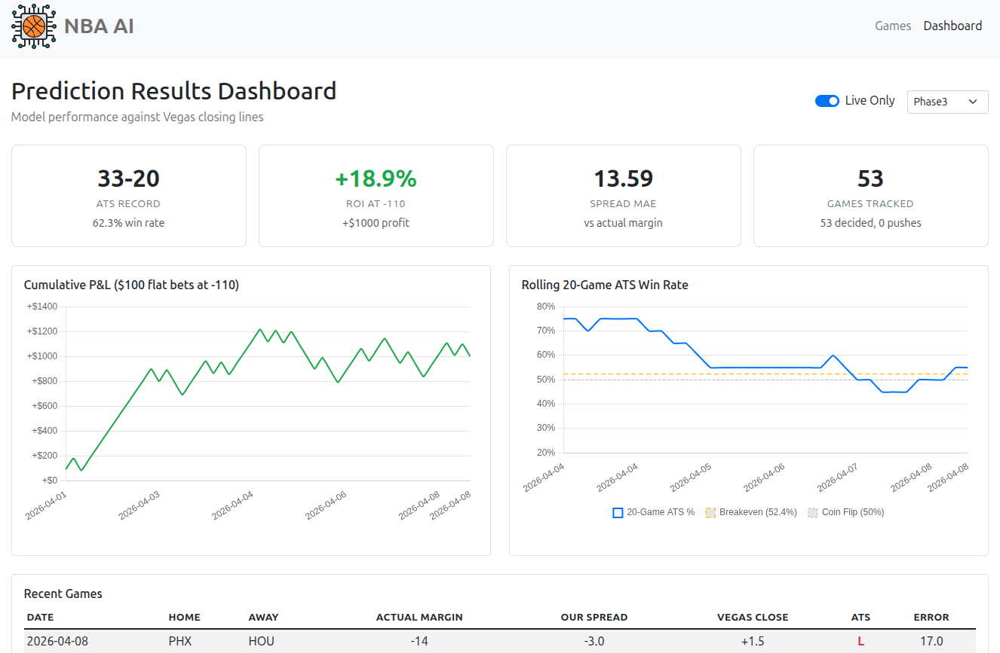
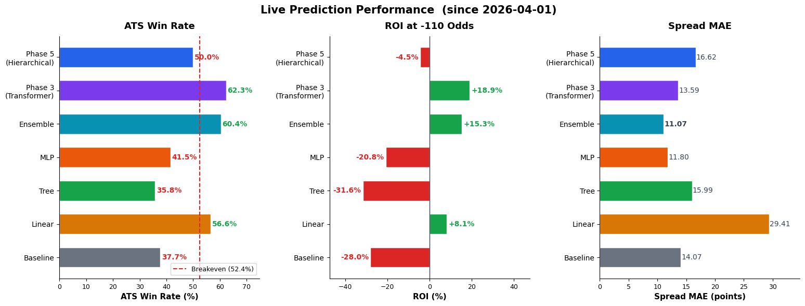

# NBA AI

## Table of Contents
* [Project Overview](#project-overview)
    * [Architecture](#architecture)
    * [Guiding Principles](#guiding-principles)
* [Web App & Dashboard](#web-app--dashboard)
* [Prediction Engines](#prediction-engines)
* [Quick Start](#quick-start)
* [Development Status](#development-status)

## Project Overview

#### Using AI to predict the outcomes of NBA games.

This project predicts NBA game spreads and winners using a combination of deep learning models and traditional ML. Unlike my previous project, [NBA Betting](https://github.com/NBA-Betting/NBA_Betting/tree/main), which focused on extensive data collection and feature engineering, this project focuses on building advanced prediction models that learn directly from play-by-play data, box scores, and player tracking — minimizing manual feature engineering in favor of letting the models find the signal.

The system runs a fully automated daily pipeline that collects game data, updates player ability models, and generates pre-game predictions for all upcoming games using multiple prediction engines. A Flask web app displays predictions alongside Vegas opening lines, with a dashboard for tracking model performance over time.

### Architecture

The system has three main layers:

* **Data Collection** — Automatically collects game data, box scores, play-by-play, injury reports, and betting lines from the NBA API and ESPN into a SQLite database.

* **Prediction Models** — Multiple prediction engines analyze the data and generate pre-game spread and winner predictions. Includes custom deep learning models, traditional ML models, and an ensemble.

* **Web App & Dashboard** — Displays games with predictions alongside Vegas lines and actual results. A dashboard tracks each model's performance over time.



### Guiding Principles



- **Time Series Data Inclusive:** Incorporating the sequential nature of events in games and across seasons, recognizing the significance of order and timing in the NBA.
- **Minimal Data Collection:** Streamlining data sourcing to the essentials, aiming for maximum impact with minimal data, thereby reducing time and resource investment.
- **Wider Applicability:** Extending the scope to cover more comprehensive outcomes, moving beyond standard predictions like point spreads or over/unders.
- **Advanced Modeling System:** Developing a system that is not only a learning tool but also potentially novel compared to the methods used by odds setters.
- **Minimal Human Decisions:** Reducing the reliance on human decision-making to minimize errors and the limitations of individual expertise.

## Web App & Dashboard





## Prediction Engines

The system runs multiple prediction engines, each taking a different approach to predicting game spreads and winners. All engines generate pre-game predictions that are evaluated against Vegas closing lines.

### Deep Learning Models

- **Phase 5 (Hierarchical)**: A 4-level neural architecture that models basketball from the ground up — individual player abilities (L1, Kalman filter), player synergy (L2, GATv2), team effects (L3), and game-level matchup prediction (L4). ~1.4M parameters, trained on play-by-play and box score data.

- **Phase 3 (Transformer)**: A roster-conditioned temporal transformer that processes each team's full season history with player-level attention. ~25M parameters, captures game-to-game dynamics and roster interactions.

### Traditional ML Models

- **Baseline**: Formula-based predictor using team PPG and opponent PPG averages.
- **Linear**: Ridge Regression on 43 rolling features from prior game states.
- **Tree**: XGBoost on the same features, with Optuna-tuned hyperparameters.
- **MLP**: PyTorch neural network (256→128→64) with batch normalization and Huber loss.

### Ensemble

- **Ensemble**: Equal-weight combination of all five models above. Averages spreads arithmetically and win probabilities in log-odds space.

### Performance

All models are evaluated against the spread (ATS) using Vegas closing lines. Performance chart will be updated once sufficient live data has accumulated.

<!-- Regenerate with: python scripts/generate_readme_chart.py -->
<!--  -->

## Quick Start

### Requirements

- Python 3.10+
- PyTorch (required for Phase5, Phase3, and MLP predictors)
- ~30GB disk space for the full database

### Installation

```bash
# Clone the repository
git clone https://github.com/NBA-Betting/NBA_AI.git
cd NBA_AI

# Create and activate a virtual environment
python -m venv venv
source venv/bin/activate

# Install dependencies
pip install -r requirements.txt

# Configure environment
cp .env.example .env
# Edit .env with your settings
```

A starter database with the current season (~1.3GB) is available from [GitHub Releases](https://github.com/NBA-Betting/NBA_AI/releases). Download and extract to `data/NBA_AI_starter.sqlite`, then update your `.env` to point to it. This includes all game data for the current season — enough to run the web app and daily pipeline with the Baseline predictor.

Trained model checkpoints for the deep learning and ML predictors are not included. To use Phase5, Phase3, or the ML predictors, train your own models using the scripts in `scripts/`.

### Running the Web App

```bash
python start_app.py --predictor=Phase5
```

Visit `http://localhost:5000` to view games and predictions.

Available predictors: `Phase5`, `Phase3`, `Baseline`, `Linear`, `Tree`, `MLP`, `Ensemble`

Phase5 and Phase3 require PyTorch and trained checkpoints. Baseline, Linear, and Tree work out of the box once the database is populated.

### Daily Pipeline

The automated pipeline collects game data, updates player models, and generates predictions:

```bash
python -m src.pipeline.orchestrator --mode=full --season=Current
```

This can be scheduled via cron for fully automated operation.

---

## Development Status

**This project is a stable release. No active development is planned.**

### Disclaimer

This is a personal side project provided "as is" with no guarantees of quality, functionality, or ongoing maintenance. While I'll try to address issues, I can't promise timely responses or fixes.

**For production or commercial use**: Consider using [SportsRadar](https://sportradar.com/), the official NBA data partner. Their API would greatly simplify data management compared to scraping the NBA Stats API. I use this approach only because I can't justify the cost for a personal project.

### Usage Notes

- **Data collection**: The web app reads from the database — it does not fetch from the NBA API on page load. Run the daily pipeline to keep data current.

- **Season restrictions**: By default, the web app allows seasons 2023-2024 through 2025-2026. To restrict or expand this, modify `valid_seasons` in `config.yaml`.

### Technical Notes

- Database: SQLite (~26GB full) with complete pipeline (Schedule → Players → Injuries → Betting → PBP → GameStates → Boxscores → Features → Predictions)
- Built with Python, Flask, SQLite, PyTorch, scikit-learn, XGBoost, and nba_api
